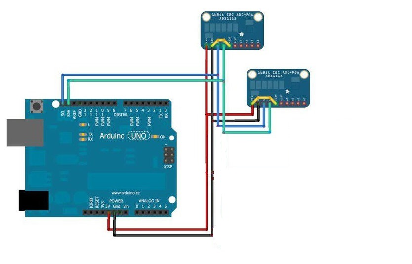
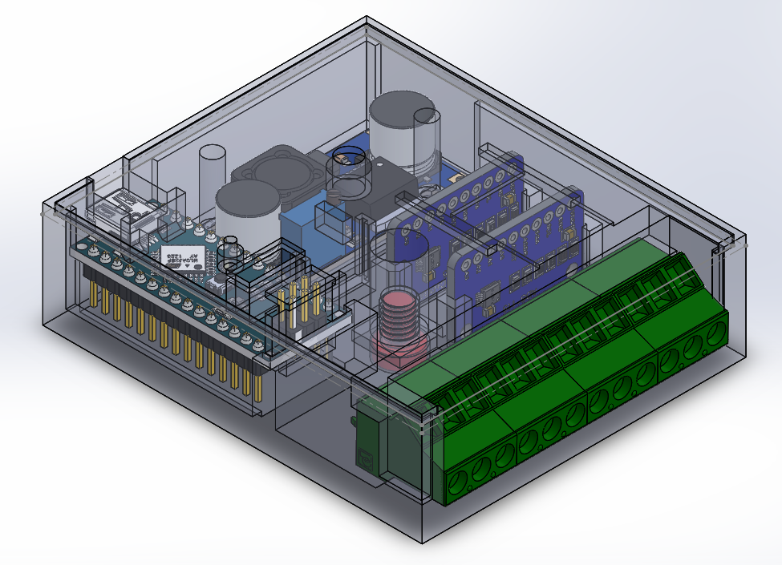
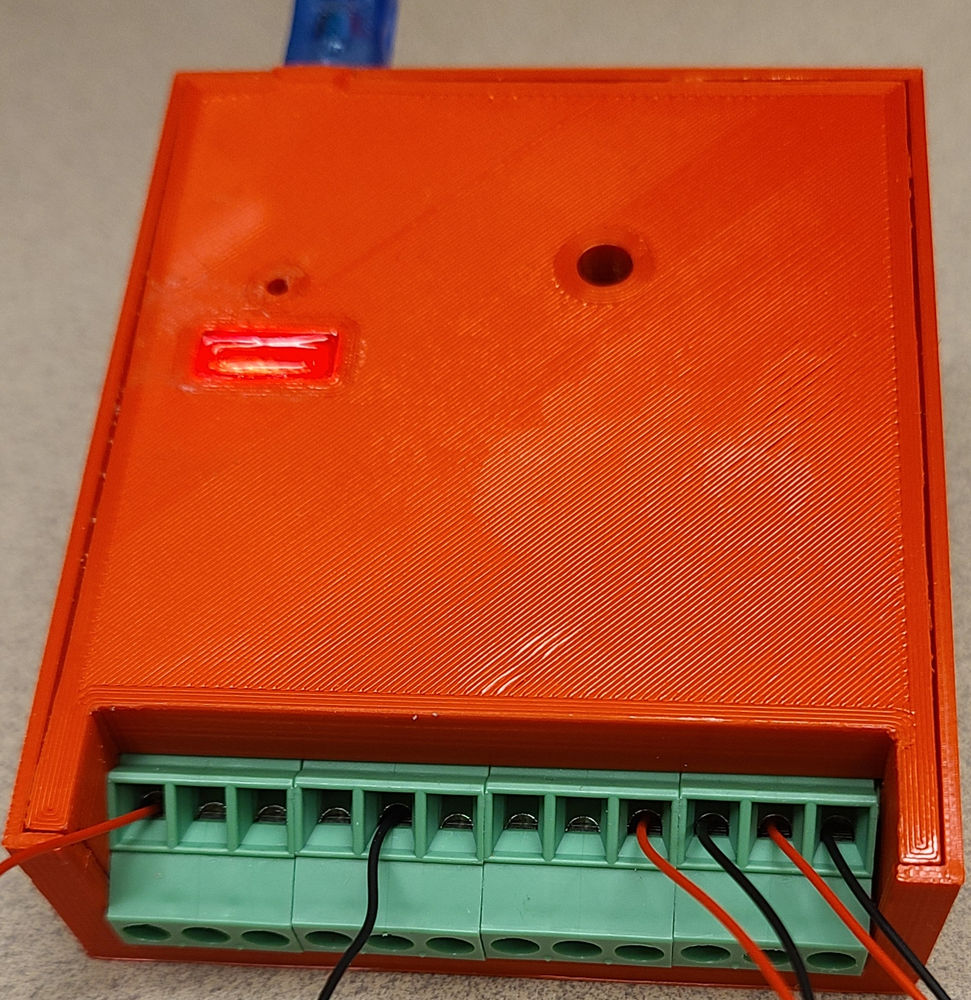
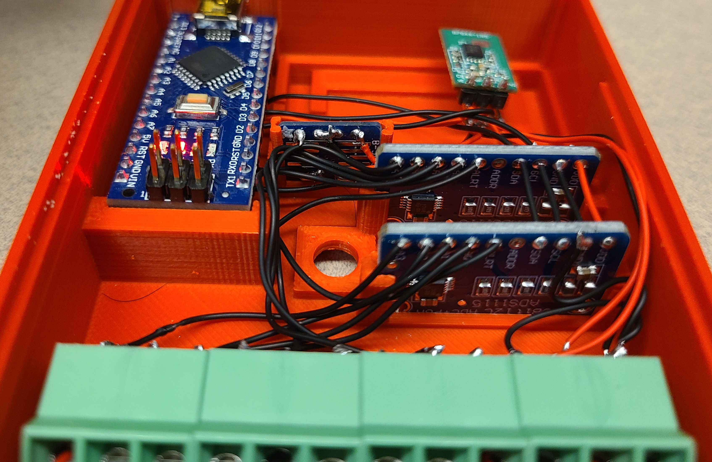

# P000-503: 8 Channel 16 Bit ADC Module
Arduino cord for the 16-bit ADC module 

# Summary
Analog to digital converter is used to convert the analog Gauss sensor values to Digital. This ADC module is build using a commonly used ADC module (ADS1115) and an Arduino Nano board. Serial Communication is utilized as a communication medium for the final ADC.

# Schematic


# Product
<p align="center">
      
      
</p>

<p align="center">
      
      
</p>

```
```

# Communication Protocol
 USB port of the Arduino nano board is utilized to communicate with the PC via serial communication. Simple protocol is built for robust communication.
 
  * Message header is OOXXXX:; where "OO" denote the read, write, execute.
  * "XXXX" followed by the "OO" is the four-digit hex number denotes the register (software define) to be read, write, execute.
  * ":" is the header separator (will be described by latter part of the protocol).
  * ";" is the end character of the protocol.
  * Each registry is assigned with different authority levels such as read(R), write(W), execute(E)
  * Naming convention for combination of read, write, and executable authority levels as follows
  ```
        * Ex 1: RR_E 
            First R denote the Register 
            Corresponding register is permissible to read and execute operations
        * Ex 1: RRW_ 
            First R denote the Register 
            Corresponding register is permissible to read and write operations
  ``` 
  * Following table denotes the current implement registries, their functionalities and authority level.

<p align="center">

|Register | Permission Level | Function |
| :------:| :----: | :---- |
| 0x0001  | RR__   | Software version |
| 0x0002  | RR__   | Hardware version |
| 0x0020  | RR__   | Input voltage of the module (Max :36V)|
| 0x0021  | RR__   | Output voltage of the module |
| 0x0030  | RR__   | ADC value of all 8 channels (hex) |
| 0x0031  | RR__   | ADC value of channle 1 |
| 0x0032  | RR__   | ADC value of channle 2 |
| 0x0033  | RR__   | ADC value of channle 3 |
| 0x0034  | RR__   | ADC value of channle 4 |
| 0x0035  | RR__   | ADC value of channel 5 |
| 0x0036  | RR__   | ADC value of channel 6 |
| 0x0037  | RR__   | ADC value of channel 7 |
| 0x0038  | RR__   | ADC value of channel 8 |
| 0x003A  | RR__   | ADC value of first six channels|
</p>

 *  Following example provide a message send to the device for requesting the software version of the device and the corresponding reply 
 ```
 Example 1: Request the software version from the device
    
        * Send Massage      : 110001:;
        * Reply from device : 110001:V1.00;

 Example 2: Requesting the ADC value of all eight channels
    
        * Send Massage      : 110030:;
        * Reply from device : 110030:0456,0421,0432,5678,0000,0434,0436,FFFF;
 ```

# Build Information
* Download and install Arduino IDE [click here](https://www.arduino.cc/en/software)
* Compile the project using Arduino ide.
* Upload the code to device.
* Use the described communication protocol to extract the values from module.


